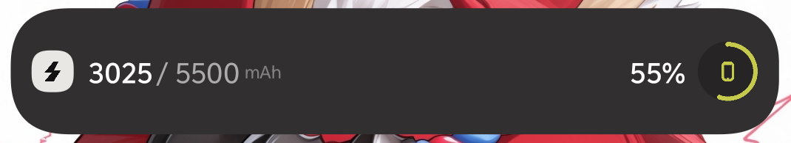

# Zmd Charge · 终末地电量 安卓桌面小组件

一个复刻《明日方舟：终末地》工业/超充风格**电量桌面小组件**（Android AppWidget）。
视觉与配色沿用 [QinAnze/zmd-charge](https://github.com/QinAnze/zmd-charge)（Windows 端灵动岛 HUD）的实测取色与矢量几何（MIT 许可）。



> 样式参考：`QinAnze/zmd-charge`（Windows 端，灵动画风，MIT）。本项目为 Android 原生小组件实现，仅复用其视觉元素与配色，底层逻辑（电量读取、组件宿主、设置页）为本项目原创。

## 功能
- **1×3 桌面小组件**（横向长条，可横向拉伸）
- 正常态复刻终末地"数字态"HUD：深炭胶囊、白色图标底板+深色闪电、**剩余/满充容量（等大数字 + mAh）**、百分比、右侧**黄绿进度环 + 手机徽章**
- **插入充电器**：短暂弹出**充电提示动画**（左发光闪电 logo + 右文：快充模式 / 充电中），**淡入→呼吸→约3.4秒后淡出**，自动回到电量显示；用 `goAsync()` 保活进程确保回落
- **充电时进度环变绿色**（#4CD964），未充电为黄绿（#C6CA4C）
- **低电量（<阈值）** 数字变红；**满充设计容量**按机型查内置表
- 点击组件进入**终末地风设置页**（原生 `androidx.preference` + 深炭/黄绿主题 + hero 顶部）
- 字体使用**鸿蒙开源字体 HarmonyOS Sans SC**
- 适配 **iQOO/OriginOS**（含打开"允许后台/自启动"提示）

## 主题（Endfield 实测色板）
| 元素 | 色值 |
|---|---|
| 深炭胶囊 | `#312F30` |
| 黄绿电光（环/闪电/徽章） | `#C6CA4C` |
| 低电量红 | `#FF4D4F` |
| 图标底板米白 | `#E9E7E4` |
| 主文字白 | `#FFFFFF` |

## 数据
- 电量百分比：`ACTION_BATTERY_CHANGED` 的 `EXTRA_LEVEL/EXTRA_SCALE`
- 剩余容量：按 `百分比×满充设计容量` 推算；若 `CHARGE_COUNTER` 读数与推算大致吻合(±25%)则优先采用，避免机型读数不准导致跳变
- 满充设计容量：读 `Build.MODEL/DEVICE` 查 **内置容量表**（`DeviceCapacity.kt`）；未命中回退到设置页"容量表兜底值"
- 插入/拔出：`POWER_CONNECTED/DISCONNECTED` 触发充电提示动画

## 构建
要求：Android SDK 35、Gradle 8.11.1、JDK 17+（本仓库已配 `android.overridePathCheck=true` 以兼容含中文目录名）。

> 字体（HarmonyOS Sans SC，约 24MB）不进 git，首次构建前先运行：
> ```powershell
> .\fetch-fonts.ps1
> ```

```bash
gradle assembleDebug   # 产物：app/build/outputs/apk/debug/app-debug.apk
```

也可用 Android Studio 直接打开本工程运行。

## 安装到手机
1. 把 `app-debug.apk` 传入手机并安装（OriginOS 需允许"未知来源安装"）。
2. 长按桌面 → 小部件 → 找到 **"终末地电力"** 拖到桌面。
3. 若刷新不及时：系统设置里将本应用设为"后台不限制/允许自启动"。

## 设备容量表说明
内置容量表（`DeviceCapacity.kt`）为**尽力维护**，按 Build.MODEL/DEVICE 子串匹配常见 iQOO/vivo 机型；**未命中时使用设置页的"容量表兜底值"（默认 5500 mAh）**，你可按实际机型在设置里修改。

## 致谢 (Credits)

本项目的视觉风格与配色**强烈参考并复刻**自 [QinAnze/zmd-charge](https://github.com/QinAnze/zmd-charge)（Windows 端终末地风格电量 HUD）。**非常感谢原作者 QinAnze 开源并采用 MIT 许可**，让我能把这份好看的"终末地工业/超充"设计用在自己的安卓小组件上。本项目的底层实现（电量读取、桌面组件、设置页、充电动画）为原创，仅复用了它的视觉要素与实测色板。

字体使用 **HarmonyOS Sans SC**（[ajacocks/harmonyos-sans-font](https://github.com/ajacocks/harmonyos-sans-font)，HUAWEI 开源、免费商用，见 `FONT_LICENSE.txt`）。
## 许可 (License)

本项目采用 **MIT License**，见 [LICENSE](LICENSE)。
