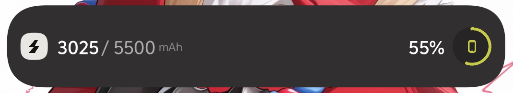

# Zmd Charge · 终末地电量 安卓桌面小组件

一个复刻《明日方舟：终末地》工业/超充风格**电量桌面小组件**（Android AppWidget）。
视觉与配色沿用 [QinAnze/zmd-charge](https://github.com/QinAnze/zmd-charge)（Windows 端灵动岛 HUD）的实测取色与矢量几何（MIT 许可）。



> 样式参考：`QinAnze/zmd-charge`（Windows 端，灵动画风，MIT）。本项目为 Android 原生小组件实现，仅复用其视觉元素与配色，底层逻辑（电量读取、组件宿主、设置页）为本项目原创。

## 下载 APK

- **v1.0.4**（最新，字体子集化约 3.2MB）：[release/zmd-charge-v1.0.4.apk](https://github.com/silicon-sbt/zmd-battery-widget/raw/main/release/zmd-charge-v1.0.4.apk)
- 历史版本：v1.0.3 / v1.0.2 / v1.0.1 → [Releases](https://github.com/silicon-sbt/zmd-battery-widget/releases)

> 说明：APK 内嵌 HarmonyOS Sans SC 字体已做**子集化**（仅含本应用用到的字符），外观与完整字体一致，体积从约 20MB 降到 3MB。

## 功能
- **1×N 桌面小组件**（横向长条）：**首次添加自动铺满整行**（N=桌面横排格数），可长按拖动边缘改宽
- 正常态复刻终末地"数字态"HUD：深炭胶囊、白色图标底板+深色闪电、**剩余/满充容量（等大数字 + mAh）**、百分比、右侧**黄绿进度环 + 手机徽章**
- **插入充电器**：短暂弹出**充电提示动画**（左发光闪电 logo + 右文：快充模式 / 充电中），**亮/暗双帧脉冲约 3.2 秒后自动收回**，回到电量显示
- **健壮性**：提示动画不使用任何 `setAlpha/setFloat` 反射动作（华为/荣耀等第三方桌面对反射动作容错差，一旦 apply 失败组件会变成“加载窗口小工具时出现问题”）；每一帧都是完整可见的静态资源，另有一层超时自愈 + 极简兜底布局，确保组件不会因渲染异常而失效
- **充电时进度环变绿色**（#4CD964），未充电为黄绿（#C6CA4C）
- **低电量（<阈值）** 数字变红；**满充设计容量**按机型查内置表，**手填可覆盖**（设置页会显示`当前生效 XXXX mAh · 依据：…`）
- 点击组件进入**终末地风设置页**（原生 `androidx.preference` + 深炭/黄绿主题 + hero 顶部）
- **运行日志**（设置页 → 诊断 → 运行日志）：记录插拔电、电量变化、每次组件渲染、前台服务生命周期、设置变更与**未捕获异常堆栈**，支持**分享 / 复制 / 清空**（256KB 自动滚动；同时镜像到 logcat，tag `ZmdCharge`）
- 字体使用**鸿蒙开源字体 HarmonyOS Sans SC**
- 适配 **iQOO/OriginOS**（含打开"允许后台/自启动"提示）

## 主题（Endfield 实测色板）
| 元素 | 色值 |
|---|---|
| 深炭胶囊 | `#312F30` |
| 黄绿电光（环/闪电/徽章） | `#C6CA4C` |
| 低电量红 | `#FF4D4F` |
| 图标底板米白 | `#E9E7E4` |
| 主文字白 | `#FFFFFF` |

## 数据
- 电量百分比：`ACTION_BATTERY_CHANGED` 的 `EXTRA_LEVEL/EXTRA_SCALE`
- 剩余容量：按 `百分比×满充设计容量` 推算；若 `CHARGE_COUNTER` 读数与推算大致吻合(±25%)则优先采用，避免机型读数不准导致跳变
- 满充设计容量优先级：**手填「标称容量」 > 内置容量表 > 默认 5500**
  - 手填过「标称容量」会自动切到**手填优先**（也可用「强制使用手填容量」开关手动控制）
  - 查表：读 `Build.MODEL | DEVICE | PRODUCT | MANUFACTURER | BRAND` 做**词边界匹配**（详见下方"设备容量表说明"）
- 插入/拔出：`POWER_CONNECTED/DISCONNECTED` 触发充电提示动画

## 更新日志

### v1.0.4
- **修复容量识别被"短键"误命中**：机型代码如一加 `PLU110` 含子串 `u1`，会命中表里的 iQOO U1（5000），导致「标称容量」怎么改都没用。现改为**词边界匹配**：
  - 键必须从"词的开头"匹配（`u1` 不再命中 `PLU110`）
  - **短键（<4 字符）必须是独立单词**（`x9` 不再命中三星平板 `SM-X910`）
  - 去掉空格的松散匹配只对 **≥6 字符**的键生效
  - 顺带修掉 `nex` 命中 **Nexus 5X**、`14 pro/13 pro/12 pro` 命中他家机型等隐患
- **新增机型**：一加 Turbo 6（`PLU110`）= 9000 mAh，另补 Turbo 5 / Ace 6 / Ace 6 Pro
- **手填容量优先级提升**：手填「标称容量」后**自动切换为手填优先**（也能手动用「强制使用手填容量」开关控制）
- **容量摘要可见化**：设置页直接显示 `当前生效 5500 mAh · 依据：容量表:v2403a`（或 手填（强制）/ 兜底值（表未命中））
- 组件日志同步改为 `容量来源=…`

### v1.0.3
- **新增**：**组件宽度** —— 首次添加即铺满整行（1×N）；设置页可选 自动 / 1~6 格并显示桌面实测格数；组件 ≤3 格自动进紧凑模式（只留 图标+百分比+环）
- **新增**：设置页 → **诊断 → 运行日志**（记录插拔电/电量/渲染/服务/设置/崩溃堆栈，可分享、复制、清空，256KB 自动滚动）
- **修复**：部分机型（如荣耀 X10）插上充电线瞬间桌面组件变成“加载窗口小工具时出现问题”
  - 充电提示动画改为**预渲染亮/暗双帧脉冲**，彻底移除 `setAlpha/setFloat` 反射类 RemoteViews 动作
  - 提示动画推送次数从约 21 次降到 **5 次**，不再在后台高频轰炸桌面宿主
  - 进度环资源 `getIdentifier` 取不到时回退到 100% 档，**绝不返回 0**（返回 0 会让桌面端取图抛异常，直接报废组件）
  - 新增**超时自愈**：提示若因进程被杀没跑完，下一次刷新会自动收回，不会长期卡住
  - 新增**极简兜底布局**：渲染异常时自动降级为纯文本显示，组件永不失效

### v1.0.2
- 前台服务（静默常驻通知）实时刷新；快充按充电电流判定；拔电 5 秒锁定未充电状态

### v1.0.3 重发补充
- 修复设置页打开即闪退（ListPreference 数组值被 AAPT2 编译成整数导致 NPE）
- 修复组件 mAh 数字消失（显示模式改为按实测宽度判断，<260dp 才紧凑）
- 容量表扩充到约 400 条主流机型；运行日志会打印命中的容量表键名
- 修复部分桌面把组件放成「高两格」（minHeight 60dp → 40dp，并开放竖向拖动修正）

### v1.0.1
- 充电时进度环变绿（#4CD964）；修复进度环方向；设置页“检查更新”

## 构建
要求：Android SDK 35、Gradle 8.11.1、JDK 17+（本仓库已配 `android.overridePathCheck=true` 以兼容含中文目录名）。

> 字体（HarmonyOS Sans SC，约 24MB）不进 git，首次构建前先运行：
> ```powershell
> .\fetch-fonts.ps1
> ```

```bash
gradle assembleDebug   # 产物：app/build/outputs/apk/debug/app-debug.apk
```

也可用 Android Studio 直接打开本工程运行。

## 安装到手机
1. 安装 [最新 Release APK](https://github.com/silicon-sbt/zmd-battery-widget/releases)（覆盖安装即可，不清数据；自签名/国产 ROM 需允许"未知来源安装"）。
2. 长按桌面 → 小部件 → 找到 **"终末地电力"** 拖到桌面。
3. 若刷新不及时：系统设置里将本应用设为"后台不限制/允许自启动"。

## 设备容量表说明
内置容量表（`DeviceCapacity.kt`）约 **600 条**，覆盖主流机型：
iQOO / vivo、华为 / 荣耀、三星 Galaxy（S/Note/Z/A/M）、Google Pixel、小米 / 红米 / POCO、OPPO / 一加 / realme、摩托罗拉 / 联想、索尼 Xperia、华硕 ROG、Nothing、努比亚 / 红魔、魅族、中兴等。

匹配规则（v1.0.4 起改为**词边界匹配**，避免误命中）：

1. 键必须从**词的开头**开始匹配 —— 所以机型代码 `PLU110` 里不会再命中 `u1`
2. **短键（<4 字符）必须是独立单词**（前面只能是空格/开头）—— `x9` 不会命中三星平板 `SM-X910`
3. 去掉空格/横线的**宽松匹配只对 ≥6 字符的键生效**，兼容 `Pixel 8 Pro` / `pixel8pro` / `SM-S928B` 等写法
4. **越具体的键排在越前面**，命中即返回

**优先级：手填「标称容量」 > 内置容量表 > 默认 5500 mAh。** 机型被认错时有两种自救方式：
① 直接在设置页填「标称容量」（填完自动切为手填优先）；② 打开「强制使用手填容量」开关。

设置页会显示 `当前生效 5500 mAh · 依据：容量表:v2403a`（或 `手填（强制）` / `兜底值（表未命中）`），运行日志里也会打印 `容量来源=…`，方便反馈补表。

## 致谢 (Credits)

本项目的视觉风格与配色**强烈参考并复刻**自 [QinAnze/zmd-charge](https://github.com/QinAnze/zmd-charge)（Windows 端终末地风格电量 HUD）。**非常感谢原作者 QinAnze 开源并采用 MIT 许可**，让我能把这份好看的"终末地工业/超充"设计用在自己的安卓小组件上。本项目的底层实现（电量读取、桌面组件、设置页、充电动画）为原创，仅复用了它的视觉要素与实测色板。

字体使用 **HarmonyOS Sans SC**（[ajacocks/harmonyos-sans-font](https://github.com/ajacocks/harmonyos-sans-font)，HUAWEI 开源、免费商用，见 `FONT_LICENSE.txt`）。
## 许可 (License)

本项目采用 **MIT License**，见 [LICENSE](LICENSE)。